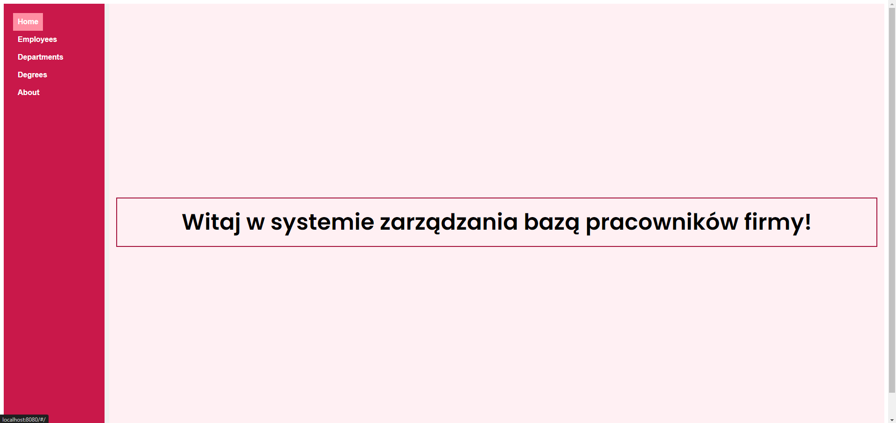
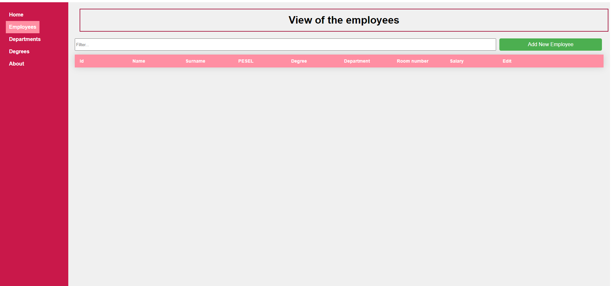
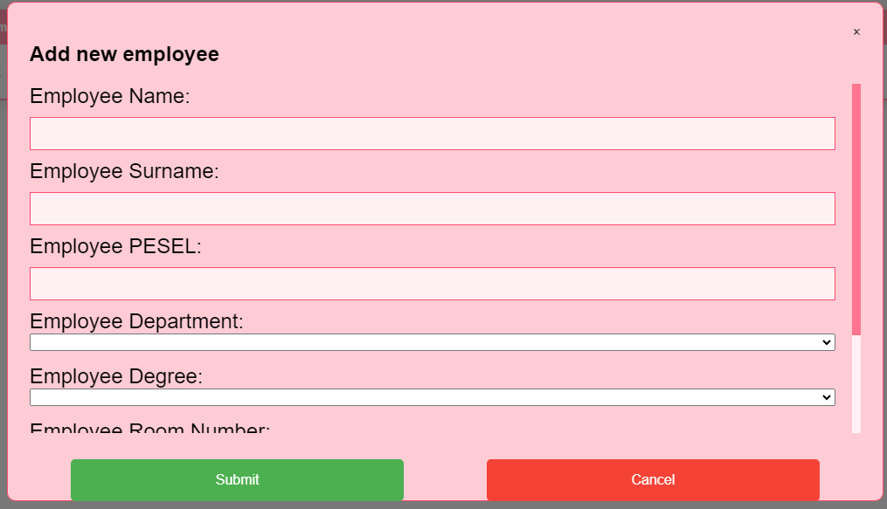
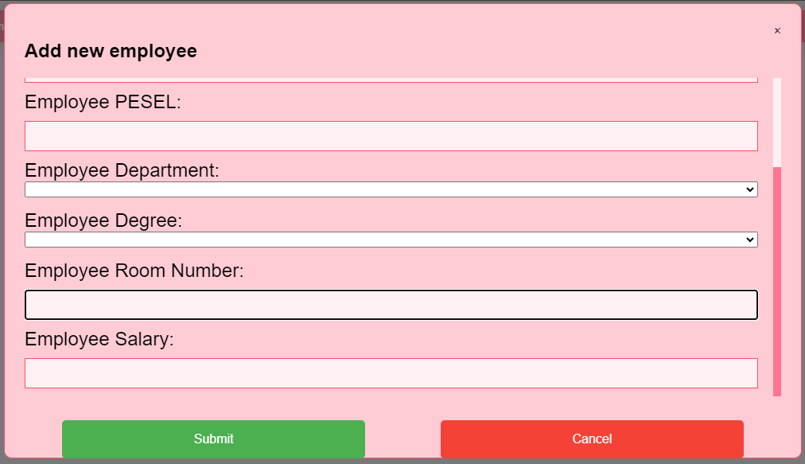
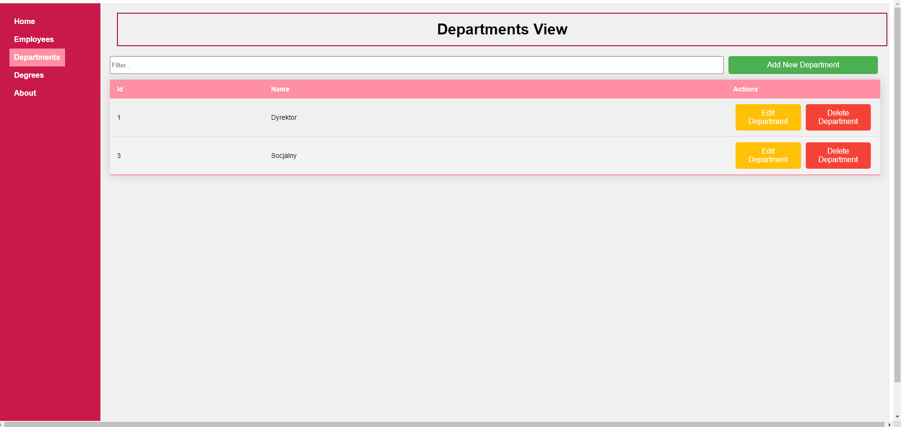
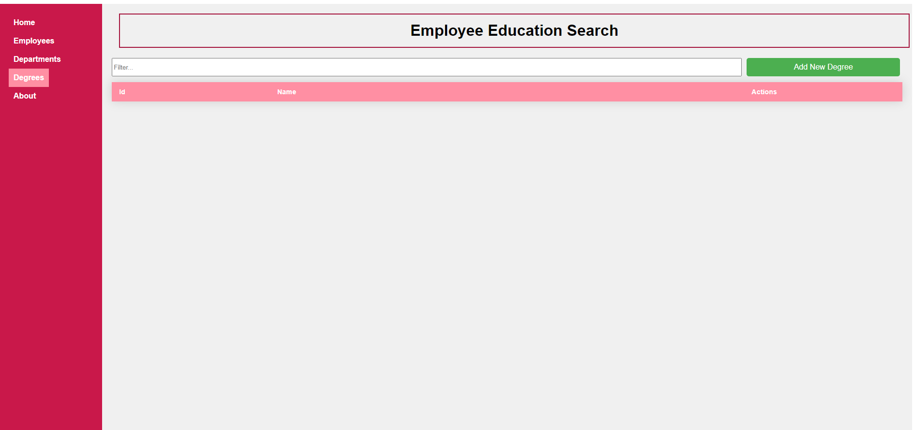

# Description

I developed this project using a combination of modern technologies and frameworks. The front-end is built with Vue.js, providing a dynamic and responsive user interface. On the server side, Flask, a lightweight web application framework written in Python, is used to handle requests and serve data. Data persistence is achieved through SQLite, a self-contained, high-reliability, embedded, full-featured, public-domain, SQL database engine.

# Front-end

The Front-end Project is a comprehensive system for managing company data, including employees, departments, and academic degrees. It consists of an HTML template for structure, a JavaScript script for future logic, and CSS styles for aesthetics and responsiveness. Users can view, filter, and manage data through interfaces with modals for adding, editing, and deleting records. The system uses axios for server communication and CSS for styling. To set up the project, clone the repository, install dependencies, and run the development server.

## Home Page

The Company Employee Database Management System consists of three main sections: the HTML template, the JavaScript script, and the CSS styles. The HTML template includes a welcome message for system users, displayed on the HomePage tab. The JavaScript script is currently empty but may contain application logic in the future, managing user interactions and communication with the database. The CSS styling includes importing the Poppins font from Google Fonts, styling the main container of the application, aligning and styling the welcome message, as well as styling the navigation and navigation links. The styling ensures an aesthetic appearance and responsiveness of the application.

## View of the employees

The Employee Management System is designed to provide a user-friendly interface for managing employee data. Users can view a table of employee details, filter the list by entering a search query, and use modals to add, edit, or delete employee records. The system includes data binding and computed properties to dynamically filter employees based on the search query. Key methods facilitate fetching employee records, adding new employees, editing existing data, and deleting records. The application also fetches department and degree data from the server and provides utility methods to retrieve department and degree names based on their IDs. The interface is styled using CSS to ensure responsiveness and an attractive appearance, utilizing grid layouts, button transitions, and custom scrollbars for modals. The project relies on axios for making HTTP requests to the server. To set up the project, clone the repository, install dependencies, and run the development server. This system offers a comprehensive and functional solution for efficient employee data management.

## Functionality of the "Add New Employee" Button
The "Add New Employee" button, displayed in the provided images, serves to open a modal form where users can input details for a new employee. This modal form includes fields for the employee's name, surname, PESEL, department, degree, room number, and salary. Upon filling out the form and clicking the "Submit" button, the entered data is sent to the server to create a new employee record. If the user decides not to add a new employee, they can click the "Cancel" button to close the modal without saving any changes. This feature ensures that users can efficiently add new employees to the system while maintaining data integrity and ease of use.

## Departments View

The Department Management System provides a user-friendly interface for managing department data. Users can view a table of department details, filter the list by entering a search query, and use modals to add, edit, or delete department records. The system includes data binding and computed properties to dynamically filter departments based on the search query. Key methods facilitate fetching department records, adding new ones, editing existing data, and deleting records. The application also fetches data from the server, ensuring information is up-to-date. The interface is styled using CSS to ensure responsiveness and an aesthetic appearance, with grid layouts, button transitions, and custom scrollbars for modals. The project relies on axios for making HTTP requests to the server. To set up the project, clone the repository, install dependencies, and run the development server. This system offers a comprehensive and functional solution for efficient department data management.

## Employee Education Search

This page is used for searching and managing employee academic degrees. Users can view a table of degree data, filter the list by entering a search query, and use modals to add, edit, or delete degree records. The system includes data binding and computed properties to dynamically filter degrees based on the search query. Key methods facilitate fetching degree records, adding new ones, editing existing data, and deleting records. The application also fetches data from the server, ensuring information is up-to-date. The interface is styled using CSS to ensure responsiveness and an aesthetic appearance, with grid layouts, button transitions, and custom scrollbars for modals. The project relies on axios for making HTTP requests to the server. To set up the project, clone the repository, install dependencies, and run the development server. This system offers a comprehensive and functional solution for efficient management of employee academic degree data.

# Backend
## Academic Degree Management Backend using SQLite
The project includes a backend for managing academic degrees using <strong>SQLite</strong>. It allows adding, editing, deleting, and displaying academic degrees stored in the database.

The Degree class represents an academic degree and has three initialization methods: with default values, with provided values, and from a tuple. The <strong>str</strong> method returns a textual representation of the object.

The function <strong>get_all_degrees(DB_path)</strong> displays a list of all academic degrees stored in the database. The function <strong>add_degree(DB_path, name)</strong> adds a new academic degree to the database. The function <strong>edit_degree(DB_path, name, Id)</strong> updates the name of an existing academic degree based on a unique identifier (Id). The function <strong>delete_degree(DB_path, Id)</strong> deletes an academic degree from the database based on a unique identifier (Id).

## Department Management Backend using SQLite
The project includes a backend for managing departments in an organization using <strong>SQLite</strong>, allowing the addition, editing, deletion, and display of departments stored in the database. The Department class represents a department and has three initialization methods: with default values, with provided values, and from a tuple, and the <strong>str</strong> method returns a textual representation of the object. The function get_all_departments displays a list of all departments stored in the database, <strong>add_department</strong> adds a new department to the database, <strong>edit_department</strong> updates the name of an existing department based on a unique identifier (Id), and <strong>delete_department</strong> deletes a department from the database based on a unique identifier (Id).

## Employee Management Backend using SQLite
The project includes a <strong> backend </strong> for managing employees in an organization using <strong>SQLite</strong>, allowing the addition, editing, deletion, and display of employees stored in the database. The Employee class represents an employee and has three initialization methods: with default values, with provided values, and from a tuple. The function <strong>get_all_employees</strong> displays a list of all employees stored in the database. The function <strong>add_employee</strong> adds a new employee to the database. The function <strong>edit_employee</strong> updates the data of an existing employee based on a unique identifier <strong>(Id)</strong>, allowing changes to information such as name, surname, PESEL number, degree identifier, department identifier, room number, and salary. The function <strong>delete_employee</strong> deletes an employee from the database based on a unique identifier (Id)