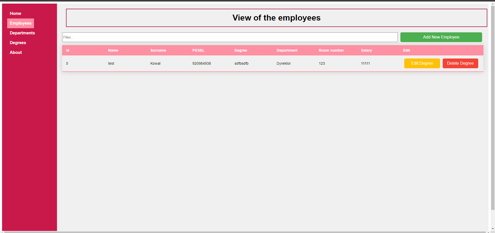

# Description

This project was developed using a combination of modern technologies and frameworks. The front-end is built with `<strong>` Vue.js `</strong>`,providing a dynamic and responsive user interface. On the server side, `<strong>`Flask `</strong>`, a lightweight web application framework written in `<strong>`Python`</strong>`, is used to handle requests and serve data. Data persistence is achieved through `<strong>`SQLite `</strong>`, a self-contained, high-reliability, embedded, full-featured, public-domain, SQL database engine.

## Home Page

System Zarządzania Bazą Pracowników Firmy składa się z trzech głównych sekcji: szablonu HTML, skryptu JavaScript oraz stylów CSS. Szablon HTML zawiera powitalny komunikat dla użytkowników systemu, wyświetlany w zakładce HomePage. Skrypt JavaScript jest obecnie pusty, ale w przyszłości może zawierać logikę aplikacji, zarządzającą interakcjami użytkownika oraz komunikacją z bazą danych. Stylizacja CSS obejmuje importowanie czcionki Poppins z Google Fonts, stylizację głównego kontenera aplikacji, wyrównanie i stylizację powitalnego komunikatu, a także stylizację nawigacji oraz linków nawigacyjnych. Stylizacja zapewnia estetyczny wygląd i responsywność aplikacji.

## View of the employees

System Zarządzania Pracownikami, został zaprojektowany w celu zapewnienia przyjaznego interfejsu do zarządzania danymi pracowników. Użytkownicy mogą przeglądać tabelę z danymi pracowników, filtrować listę poprzez wprowadzenie zapytania wyszukiwania oraz korzystać z modali do dodawania, edytowania lub usuwania rekordów pracowników. System obejmuje wiązanie danych i właściwości obliczeniowe, aby dynamicznie filtrować pracowników na podstawie zapytania wyszukiwania. Kluczowe metody ułatwiają pobieranie rekordów pracowników, dodawanie nowych pracowników, edytowanie istniejących danych oraz usuwanie rekordów. Aplikacja pobiera również dane o departamentach i stopniach ze serwera oraz udostępnia metody pomocnicze do pobierania nazw departamentów i stopni na podstawie ich identyfikatorów. Interfejs jest stylizowany za pomocą CSS, aby zapewnić responsywność i atrakcyjny wygląd, wykorzystując układy siatki, przejścia przycisków i niestandardowe paski przewijania dla modali. Projekt opiera się na axios do wykonywania żądań HTTP do serwera. Aby skonfigurować projekt, należy sklonować repozytorium, zainstalować zależności i uruchomić serwer deweloperski. Ten system oferuje kompleksowe i funkcjonalne rozwiązanie do efektywnego zarządzania danymi pracowników.

## Departments View

System Zarządzania Departamentami, zapewnia przyjazny interfejs do zarządzania danymi departamentów. Użytkownicy mogą przeglądać tabelę z danymi departamentów, filtrować listę poprzez wprowadzenie zapytania wyszukiwania oraz korzystać z modali do dodawania, edytowania lub usuwania rekordów departamentów. System obejmuje wiązanie danych i właściwości obliczeniowe, aby dynamicznie filtrować departamenty na podstawie zapytania wyszukiwania. Kluczowe metody ułatwiają pobieranie rekordów departamentów, dodawanie nowych, edytowanie istniejących danych oraz usuwanie rekordów. Aplikacja pobiera również dane z serwera, zapewniając aktualność informacji. Interfejs jest stylizowany za pomocą CSS, aby zapewnić responsywność i estetyczny wygląd, z układami siatki, przejściami przycisków oraz niestandardowymi paskami przewijania dla modali. Projekt korzysta z axios do wykonywania żądań HTTP do serwera. Aby skonfigurować projekt, należy sklonować repozytorium, zainstalować zależności i uruchomić serwer deweloperski. System oferuje kompleksowe i funkcjonalne rozwiązanie do efektywnego zarządzania danymi departamentów.

## Employee Education Search

